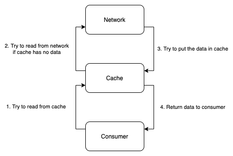

# Android-Architecture-Repository

#### Preparation

If you don't know what is repository pattern, please take a look this page.

[Android Repository Pattern](https://developer.android.com/jetpack/docs/guide)

#### Background

From the example that including the cache implementation. [Cache Data](https://developer.android.com/jetpack/docs/guide#cache-data)

It mentioned about the `UserRepository` which implemented cooperation between `UserCache` and `Webservice`.

The basic idea of the example is

```
if (cache has data) {
    return cacheData
}
val networkData = getAPIData()
cache(networkData)
return networkData
```

#### Information Detail

Actually this process could be standardized.

Here is the diagram of the concept of the example.



Excluding `Consumer`, the sequence of bottom-up is real, top-down is write

In this example, the sequence is
1. cache: read (go up)
2. network: read (go up)
3. cache: write (go down)

In summary, the common pattern of the different cache strategies can be visualize like following:

|Cache Strategy|Visualized Diagram|Usage|
|---|---|---|
|Standard||Normal usage, accessing data with cache.|
|Network Only||Some API doesn't has cache.|
|Cache Only||Offline mode, or you just want to show the data from cache.|
|Cache then network||Some social application. Display cache data first, then get the updated data from server|
|Network replace cache||Nne GET request that modify the data|

With standardized cooperator, the data provider could focus on its duty.

#### Example

[Implementation of User Repository](app/src/main/java/com/codedeco/lib/arch/repository/example)


P.S. Local is NOT disk cache, it just mean local file.

#### Integration Guideline
1. Prepare you interface and implementation for the data provider
```
interface FooService {
    fun get(param: Param): Response?
}
class FooServiceNetwork : Foo{
    ....
}
class FooServiceCache : Foo{
    ....
    fun put(param: Param, response: Response)
}
```
2. Create your repository
   - For coroutine, it returns Flow<T> as interface
   - For Rx, it returns Observable<T> as interface

Example for Coroutine
```
class FooRepositoryCoroutine {
    private val repositoryHelper = RepositoryHelper<FooService>
    init {
        repositoryHelper.addDataSource(DataSource.Network, FooServiceNetwork())
        repositoryHelper.addDataSource(DataSource.Cache, FooServiceCache())
    }
    fun get(param: Param): Flow<Response?> {
        return repositoryHelper.execute(
            CacheStrategy.Standard // Select your cache strategy for the data retrieval,
            { service ->
                service.get(param) // Data retrieval
            },
            { service, response ->
                 if (service is FooServiceCache && response != null) { // Do checking for caching the data
                     service.put(param, response)
                 }
            }
        )
    }
}
```
Example for Rx
```
class FooRepositoryRx {
    private val repositoryHelper = RepositoryHelper<FooService>
    init {
        repositoryHelper.addDataSource(DataSource.Network, FooServiceNetwork())
        repositoryHelper.addDataSource(DataSource.Cache, FooServiceCache())
    }
    fun get(param: Param): Observable<Response?> {
        return repositoryHelper.execute(
            CacheStrategy.Standard // Select your cache strategy for the data retrieval,
            { service ->
                service.get(param) // Data retrieval
            },
            { service, response ->
                 if (service is FooServiceCache && response != null) { // Do checking for caching the data
                     service.put(param, response)
                 }
            }
        )
    }
}
```